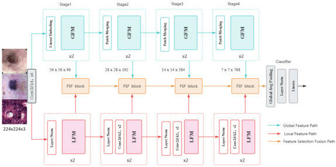

# 一、SGS-Net: A Two-stream Gated Feature Selection and Fusion Classification Network for Medical Image Analysis
The official implement of the SGS-Net \

# 二、‎dataset 
The data that support the findings of this study are available from the corresponding author upon reasonable request.  \
The dataset is also available at https://dl.acm.org/doi/pdf/10.1145/3083187.3083212. \
https://www.kaggle.com/c/siim-isic-melanoma-classification/data. \
https://www.nature.com/articles/srep27988. 

# 三、Dataset Information 
**Kvasir:** The Kvasir dataset is a publicly available dataset comprising 4000 endoscopic images of gastrointestinal diseases. These images are categorized into 8 classes, with each class containing 500 images. The dataset encompasses a diverse range of images within each category, featuring anatomical landmarks such as the Z-line, pylorus, and caecum, as well as pathological findings including esophagitis, polyps, and ulcerative colitis. The original images in the dataset have a resolution of 720 × 576 pixels, but all images have been resized to 224 × 224 pixels for computational efficiency. For our experiments, the dataset was partitioned into training, validation, and test sets in the ratio of 7:1.5:1.5. \
**ISIC2018-small:** This dataset is a subset of the ISIC2018 Challenge dataset.Given the significant imbalance in the number of samples across categories within the original ISIC2018 dataset, this subset excludes dermoscopic images of diseases other than melanoma. Consequently, it retains only two categories with a more balanced distribution of samples: benign skin nevi and malignant skin nevi. The dataset comprises 2,643 samples, each with a resolution of 224×224 pixels. We adhered to the partitioning scheme of the original dataset, resulting in a training set of 2,212 samples (1,099 benign and 1,113 malignant). Additionally, the test set consists of 388 samples, including 217 benign samples and 171 malignant samples. \
**Multi-class texture analysis in colorectal cancer histology:** This dataset is derived from a publicly available dataset of real clinical samples provided by institutions such as Heidelberg University Hospital in Germany. Tissue types within this dataset are differentiated through histopathological evaluation of hematoxylin and eosin (H&E)-stained tissue sections. The dataset encompasses eight histological categories, including normal tissues, precancerous lesions, and cancerous regions. It consists of 5,000 high-resolution histopathological images, with 625 samples per category. Each image represents a 150×150 pixel local region. For our experiments, the dataset was partitioned into training, validation, and test sets in the ratio of 7:1.5:1.5. 

# 四、Code Information 
I've included my main model code main_model.py, the training file train.py, and the eight-class test file predict_8.py. 

# 五、Usage Instructions – How to use or load the dataset and code 
## 1、Load our master model 
from model.main_model import HiFuse_Tiny 
 model = HiFuse_Tiny(num_classes=num_classes) 
## 2、Set the project hyperparameters 
 **Random seed** \
    seed = 42 \
 **Batch size** \
    batch_size = 32 \
 **Number of classes** \
    num_classes = 8 \
 **Learning rate** \ 
    lr = 1e-4 \
    lr = 1e-5 \
  **Saving the learning rate** \
    lr_arr = [] \
   **Number of training** \
    epochs = 300 \
   **Best results** \ 
     best_acc = 0.0 \
   **Discard the branching rate** \
    drop_path_rate = 0.2 \
   **Break point** \
    state_epoch = 0 \
   **Input image size** \
    image_size = 224 \
   **Whether to start training from the interrupt point** \
    resume_training = False \
   **Whether to load the pretrained model** \
    pretrained = False 
## 3、Loading the dataset 
    DATASETS_ROOT = "<your_datasets_path>" \
    ROOT_TRAIN = os.path.join(DATASETS_ROOT, 'train') \
    ROOT_VAL = os.path.join(DATASETS_ROOT, 'val') 
## 4、Loading GPU
    device = torch.device("cuda:0" if torch.cuda.is_available() else "cpu") 

# 六、‎Requirements – Any dependencies
## 1、Env
python3.8\
cuda 12.6

## 2、Train & Test Pipeline
1、python train.py \
2、python predict.py

